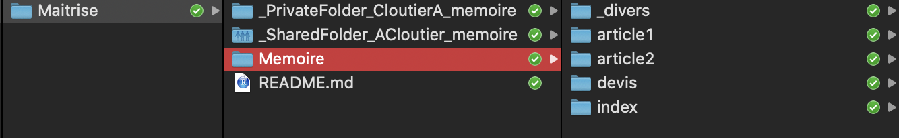
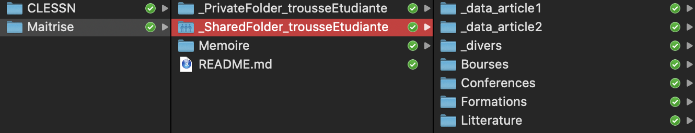
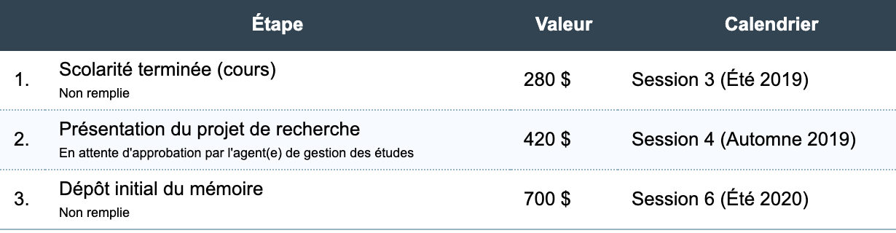

# Bonjour cher(chère) étudiant(e)

## Supervision par Yannick Dufresne, Université Laval

Afin de faciliter au maximum votre cheminement scolaire et votre introduction à notre équipe de travail, je vous invite à télécharger ce repository Github. Il est accompagné d'un dossier Dropbox qui vous sera partagé. 
Le fichier README (que vous consultez actuellement) permet de détailler tous les éléments des différents dossiers Github et Dropbox, en plus d'expliciter le mode d'emploi de notre collaboration. 
N'ayez crainte, ça finira rapidement par être très simple!

### D'abord, voici les 10 premières étapes à suivre au départ d’une supervision :

1. Acheter un Dropbox professionnel et l'installer sur votre ordinateur (17,50$CA/mois quand on prend l'abonnement annuel);
2. Télécharger ce repository («trousse_etudiante») et le stocker dans votre Dropbox;
3. Renommez-le comme il vous plait (par exemple: «Maitrise»);
4. Ajouter le dossier Dropbox _SharedFolder_trousseEtudiante qui vous a été partagé À L'INTÉRIEUR du repository *trousse_etudiante* (que l'on a renommé «Maitrise»);
5. Créer un dossier nommé *_PrivateFolder_trousseEtudiante* et le glisser dans «Maitrise»;
6. Installer Slack, qui sert aux communications de l'équipe (https://slack.com/intl/fr-ca/);
7. Installer R, qui sert à l’analyse de données (https://www.r-project.org/); 
8. Installer LaTeX, une plateforme de création de documents (https://www.latex-project.org/get/);
9. Installer RStudio, le logiciel qui héberge R et LaTeX (https://rstudio.com/products/rstudio/download/);
10. Dans votre Dropbox, vous pouvez déjà créer un autre dossier nommé «CLESSN» (il servira à entreposer tous les projets de notre équipe).

C'est fait? Bravo! Le plus dur est passé!
Maintenant, concentrons-nous sur la logique de vos nouveaux dossiers.

### La logique du dossier Github (trousse_etudiante), fichier par fichier:

1. **Memoire** (dans ce dossier, vous pouvez commencer la rédaction de votre mémoire)
  - *_divers* (tous les divers éléments intéressants ou nécessaires à votre mémoire, mais pas les données)
  - *article1* (commençons par la rédaction de l'article 1)
    - _graphs (il s'agit d'une exception, mais ici se trouveront vos graphiques finaux en format png à être insérés dans votre article)
    - code (ici se retrouvera votre fichier R)
    - writing (vous pourrez créer un beau document RMarkdown pour l'occasion!)
  - *article2* (puis poursuivons avec l'article 2)
    - _graphs
    - code
    - writing
  - *devis* (puisque vous devrez défendre votre devis de recherche devant votre comité, mieux vaut prévoir un dossier où vous le rédigerez. Pour l'instant, vous y retrouverez le gabarit officiel en format LaTeX de l'Ulaval.)
  - *index* (dans index, vous trouverez le gabarit RMarkdown pour la rédaction d'un mémoire par article. Amusez-vous à fouiller les différents dossiers et à les comprendre!)
2. **README.md** (tout bon logiciel, package ou repository a un README. Il s'agit simplement d'un fichier texte contenant la description et les instructions du dossier)
3. **.gitignore** (le fichier texte caché .gitignore est nécessaire pour ignorer la mise en ligne de certains fichiers à l'intérieur de notre repository Github. Par exemple, dans notre cas, même si nous avons ajouté le _SharedFolder_trousseEtudiante à l'intérieur de trousse_etudiante, il sera ignoré par le .gitignore. Allez voir par vous-même!)

### La logique du dossier Dropbox (_SharedFolder_trousseEtudiante), fichier par fichier :

1. **_data_article1** (ici, vous entreposerez les données de votre article 1)
2. **_data_article2** (même chose ici, pour l'article 2)
3. **_divers** (on vous a déjà mis les cheat sheets pertinentes, des guides de rédaction et les recueils créés par la CLESSN pour faciliter l'apprentissage de méthodologies)
  - *CheatSheets*
  - *Outils*
  - *Recueils*
4. **Bourses** (il est essentiel d'appliquer à l'obtention de bourses d'études! Voici les plus importantes et leurs instructions)
5. **Conferences** (vous ferez -- ou participerez -- sans doute à plusieurs conférences pendant vos études. Voici les plus importantes)
6. **Formations** (vous serez invité à participer à l'école d'été méthodologique ICPSR de l'Université du Michigan! Il s'agit d'un excellent complément à votre formation. Les cours en ligne de Datacamp serviront aussi à solidifier votre base en R)
  - *Datacamp*
  - *ICPSR*
7. **Litterature** (ici, vous entreposerez votre fichier bibtex contenant toute la bibliographie de votre mémoire. Commencez à la nourrir dès maintenant!)
  - *bibfile.bib*
  

### IMPORTANT

Vos données doivent **en tout temps** demeurer dans le *_SharedFolder_trousseEtudiante*. Comme mentionné, ce dossier Dropbox est ignoré par le .gitignore, c'est-à-dire qu'il ne sera **jamais** partagé en ligne, même lors d'un git push. Ainsi, vos données resteront confidentielles, sur votre ordinateur. C'est la logique que nous utilisons pour tous nos projets en équipe. 
De plus, nous avons aussi pensé le fichier .gitignore pour qu'il ignore les dossiers dont le nom débute par *_PrivateFolder...*. C'est pourquoi vous l'avez créé plus haut! Vous pourrez y glisser tout votre travail personnel (par exemple, les dossiers relatifs à vos cours). Ce dossier restera confidentiel; il ne sera ni publié en ligne ni partagé avec moi. 

### Git et Github

D'ailleurs, pour bien saisir la logique de Git et de Github, nous vous conseillons de visionner les tutoriels *Git and GitHub for Poets* de la chaine Youtube The Coding Train (voici le lien du premier vidéo: https://www.youtube.com/watch?v=BCQHnlnPusY&t=3s). Vous êtes également invité à compléter le cours Datacamp *Introduction to Git*.

### Datacamp

Parlant de Datacamp, voici une série de cours utiles à l'introduction à R:
  - Introduction to R
  - Intermediate R
  - Introduction to the Tidyverse
  - Data Manipulation with dplyr
  - Correlation and Regression in R
  - Multiple and Logistic Regression in R
  - Data Visualization with ggplot2 (Part 1)
  - Text Mining with Bag-of-Words in R
  
### Lectures
  
Finalement, vous pouvez déjà vous lancer dans la lecture de KKV. **Designing Social Inquiry (1994)** est un ouvrage d'introduction à la méthodologie de recherche en science sociale rédigé par Gary King, Robert Keohane et Sidney Verba (le surnom KKV vient des initiales de leur nom de famille!). Tous les étudiant.es de la CLESSN l'ont déjà lu une fois... ou plus! Le recueil «Devis de recherche», monté et utilisé pour le cours de Devis de recherche, est également une bonne lecture à faire. Vous le retrouverez dans _SharedFolder_trousseEtudiante -> _divers -> Recueils.
  
### Rencontres
  
Vous n'avez jamais codé en R et vous avez tapé "Mark Down" dans Google en pensant qu'il s'agissait d'un grand scientifique anglais? Aucune crainte! Vous êtes au bon endroit pour vous initier et rapidement développer une expertise dans les sciences sociales numériques. Plusieurs étudiants de l'équipe n'avaient jamais codé avant leur arrivée! Pour apprendre rapidement, le mieux est de commencer maintenant, et d'en faire un peu tous les jours. Quelques pages de KKV, une vidéo YouTube, un cours de Datacamp, et surtout, la participation aux scrums! Les scrums permettent à l'équipe de se rassembler et de faire le point sur l'avancement des différents projets. Il y en a 3 par semaine, en plus du *Mardi métho* et du *Jeudi 3P*. Vous êtes bien sûr invité à vous joindre à nous en personne ou via Slack (à distance, les rencontres se font dans la chaine **00_général**). Voici les heures de rencontres:

  - Mardi, 15h30-16h30 (*Mardi métho*, on fait des lectures et on jase méthodologie);
  - Mardi, 16h30-17h15 (scrum long de 45 minutes, pour suivre l'avancement des projets);
  - Jeudi, 15h30-16h30 (*Jeudi 3P*, on présente un ou des projets plus en détail, et on les commente en équipe);
  - Jeudi, 16h30-16h45 (scrum court de 15 minutes);
  - Dimanche, 16h30-16h45 (scrum court de 15 minutes).
  
### Slack
  
Si vous êtes à distance, les rencontres (scrums) se font aussi sur Slack (bien qu'il soit préférable d'être à l'Université le plus régulièrement possible). D'ailleurs, Slack est notre outil de communication principal. Déjà, vous pouvez demander d'être ajouté aux chaines suivantes:

  - 00_calendrier (pour recevoir les notifications du Google Calendar de la CLESSN);
  - 00_communication (pour la communication de la chaire);
  - 00_financement (pour le financement de la chaire);
  - 00_général (pour les rencontres, et les discussions générales);
  - 00_git (pour suivre l'évolution des commits git);
  - 00_mardi-metho (pour organiser les mardis méthos);
  - 00_publication (pour suivre l'évolution des publications de la chaire);
  - 99_sante-bien-etre (pour assurer la santé et le bien-être à la chaire!).
  
Il existe beaucoup d'autres chaines Slack. Plusieurs sont publiques (vous pouvez les trouver vous-même et vous y ajouter en cliquant sur «Canaux»), d'autres sont privées (vous devez demander d'y être ajoutées). À la CLESSN, les chaines débutant par 00 sont les chaines de bases. D'autres chaines existent ensuite selon les projets (01, 02, etc.), et vous y serez ajouté selon votre participation à ceux-ci. Les chaines 98 sont dédiées aux discussions méthodologiques. Les chaines 99 sont des chaines mélimélos, parfois plus ludiques. Voici, d'ailleurs, certaines chaines qui pourraient vous intéresser (il y en a beaucoup d'autres!):

  - rss_985 (amateur de Paul Archand? Retrouvez chaque matin toutes les chroniques de son émission Puisqu'il faut se lever!);
  - rss_lapresse (en temps réel, vous recevrez des notifications des nouvelles politiques de La Presse);
  - 98_méthode_analyse-textuelle (vous avez des questions à propos de l'analyse textuelle? C'est l'endroit!);
  - 99_random (pour tout... et rien).
  
### ICPSR

Si je vous supervise, c'est que vous acceptez d'aller à ICPSR Summer Program de l'Université du Michigan. Il s'agit d'une école d'été (parmi les meilleures au monde) lors de laquelle vous pourrez approfondir vos connaissances en méthodologie quantitative. La participation à cette école constitue un rite de passage pour tous mes étudiants depuis 2017! Pour toutes les informations, voir le site web: https://www.icpsr.umich.edu/icpsrweb/sumprog/.

### Bourses

Pour financer votre participation à ICPSR, voire pour financer vos études en général, il existe de nombreuses possibilités de bourses. Voici les plus populaires. À noter que les dates d'inscription sont offertes à titre informatif, mais celles-ci peuvent être modifiées d'année en année.

1. FRQSC (9 octobre): Le Fond de recherche du Québec Société et Culture est l'équivalent provincial du CRSH. Il offre aussi 17 500$ pour les études à la maitrise.
https://www.sshrc-crsh.gc.ca/funding-financement/programs-programmes/fellowships/cgs_masters-besc_maitrise-fra.aspx
2. CRSH (13 décembre): Le Conseil de recherches en sciences humaines du Canada offre chaque année une possibilité de financement de 17 500$ pour les études à la maitrise. Il s'agit de la plus haute bourse de votre champ d'études, et ainsi de la plus prestigieuse. Mais elle reste à portée de tout bon dossier. https://www.sshrc-crsh.gc.ca/funding-financement/programs-programmes/fellowships/cgs_masters-besc_maitrise-fra.aspx
3. ICPSR (31 mars): Plusieurs bourses sont offertes directement par ICPSR. Ça vaut la peine de tenter sa chance!
https://www.icpsr.umich.edu/icpsrweb/content/sumprog/scholarships/index.html

Et voici les opportunités de financement des groupes de recherche auxquels vous faites maintenant partie:

4. OBVIA (30 août): L'Observatoire international sur les impacts sociétaux de l'IA et du numérique organise chaque année un concours de bourse de 15 000$ pour la réalisation d'un mémoire en lien avec leurs objectifs.
https://observatoire-ia.ulaval.ca/programmes-de-bourses-dappui-a-la-releve-de-lobvia/
5. CÉCD (30 septembre et 1er mars): Le Centre pour l'étude de la citoyenneté démocratique offre 750\$ par année pour la présentation à l'étranger d'un article scientifique. Il est toutefois nécessaire d'indiquer au CECD avant le 30 septembre que vous comptez utiliser cette bourse (je vous conseille de le faire, même si vous ne pensez pas l'utiliser!). Aussi, le CÉCD offre 2500\$ en bourse de formation méthodologique (comme la participation à ICPSR).
https://csdc-cecd.ca/fr/resources/csdc-student-funding-fr/
6. GRCP (en tout temps): Le Groupe de recherche en communication politique offre 800$ par année pour la formation méthodologique et la diffusion de vos résultats de recherche. À prendre ou à laisser!
https://www.grcp.ulaval.ca/ressources/formulaires
7. Département de science politique (en tout temps): Ce n'est pas un groupe de recherche, mais le département offre 2000$ par année pour la formation méthodologique.
https://repertoire.bbaf.ulaval.ca/bourse/52857/bourses-de-formations-methodologiques-hiver-2020

Il existe beaucoup d'autres bourses, à vous maintenant de fouiller et à me faire part de vos trouvailles!

### Cheminement «normal»

Sachez aussi que la Faculté des sciences sociales offre un financement de 1400\$ en trois versements pour tous les étudiants qui effectuent leur Maîtrise en science politique dans des temps considérés comme étant «normaux» par la Faculté: https://www.bourses.fss.ulaval.ca/connexion. C'est-à-dire que vous pouvez réclamer 280\$ si vous complétez l'ensemble de vos cours en 3 sessions, un autre 420\$ si votre projet de recherche est défendu avant la 4e session, et un dernier 700$ si votre mémoire est déposé avant la 6e session. Conseil d'ami: prenez en considération ces délais, mais ne laissez pas l'argent associé vous aveugler. Mieux vaut un bon projet bien réfléchi, même s'il est défendu la 5e session.

### Panique?

Bien sûr que non! La CLESSN travaille dans l'objectif d'optimiser constamment son travail. Tous les étudiants ont réussi, en avançant pas-à-pas dans leurs apprentissages, à développer les outils essentiels à leur cheminement scolaire et, en plus, à apporter leur propre contribution à la chaire. Pas de panique, donc, si vous n'avez jamais codé et si tout ça semble complexe! C'est complètement à votre portée. 

Je vous souhaite d'excellentes études.
Je vous l'assure, le temps passera très vite!

## Yannick Dufresne

